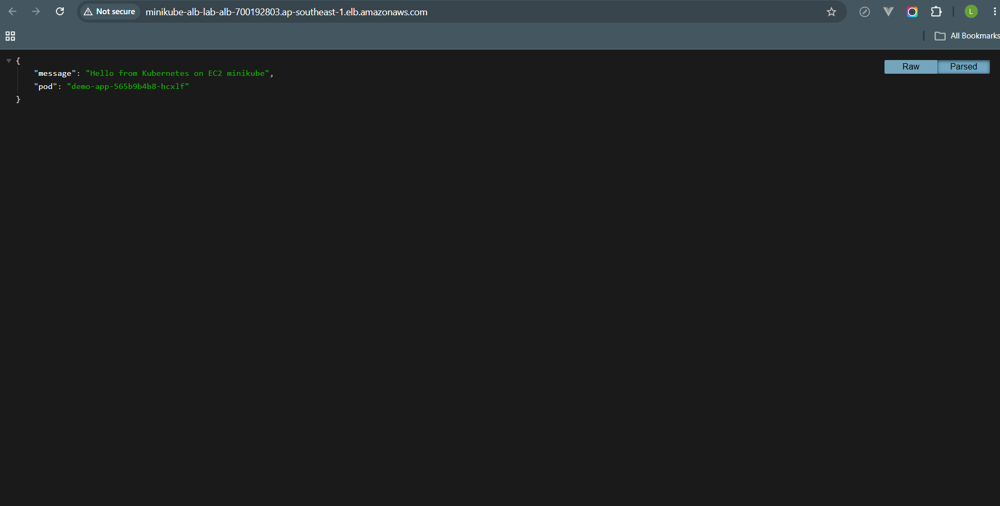
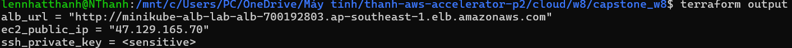
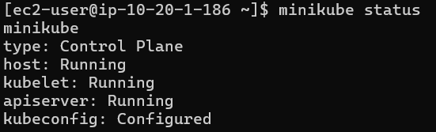
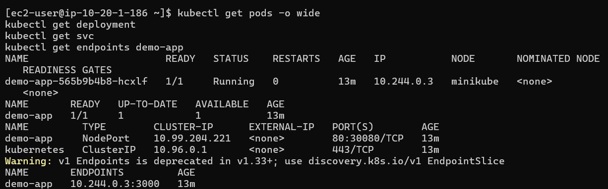
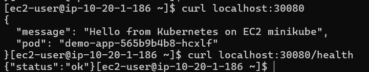
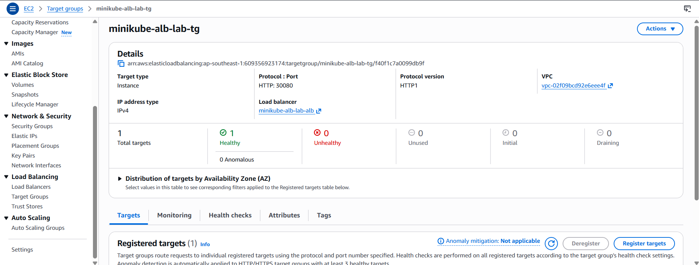
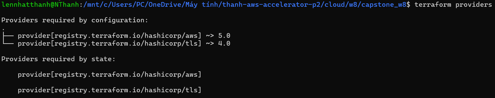
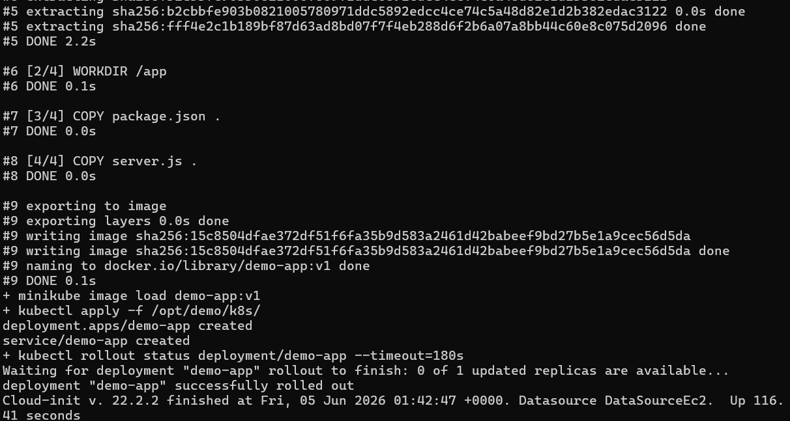
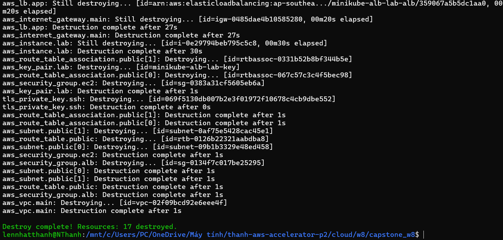

# Báo Cáo Bằng Chứng - Capstone W8

## Tổng Quan Dự Án

Dự án này dùng Terraform để dựng hạ tầng trên AWS, tạo một EC2 instance, chạy cụm Kubernetes bằng minikube bên trong EC2, deploy một ứng dụng Node.js nhỏ vào Kubernetes, sau đó expose ứng dụng ra Internet thông qua Application Load Balancer (ALB).

Các thành phần chính:

- Terraform tạo VPC, public subnet, Internet Gateway, route table, security group, EC2, ALB, target group và listener.
- EC2 tự bootstrap bằng `user_data` khi khởi động.
- Minikube chạy trên EC2 bằng Docker driver.
- Ứng dụng chạy trong Kubernetes Pod, không cài trực tiếp trên EC2.
- ALB forward traffic vào EC2 port `30080`.
- Kubernetes Service dùng loại `NodePort` để đưa traffic vào Pod.
- Terraform sử dụng 2 providers: `hashicorp/aws` và `hashicorp/tls`.

## 1. Ứng Dụng Truy Cập Được Qua ALB

Bằng chứng này xác nhận URL của ALB có thể mở được từ browser và trả về response của ứng dụng.

Lệnh lấy ALB URL:

```bash
terraform output alb_url
```

ALB URL:

```text
http://REPLACE_WITH_ALB_DNS_NAME
```

Ảnh minh chứng:



Kết quả ghi nhận:

Browser hiển thị JSON response từ ứng dụng Node.js, ví dụ có message và hostname của Pod.

Luồng truy cập:

```text
Browser
  -> ALB
  -> EC2:30080
  -> minikube NodePort
  -> Kubernetes Service
  -> Pod ứng dụng
```

## 2. Terraform Outputs

Bằng chứng này xác nhận Terraform đã apply thành công và xuất ra các thông tin cần thiết.

Lệnh:

```bash
terraform output
```

Ảnh minh chứng:



Kết quả ghi nhận:

- `alb_url`: URL dùng để mở ứng dụng.
- `ec2_public_ip`: public IP của EC2 để SSH debug.
- `ssh_private_key`: private key, được đánh dấu là sensitive.

## 3. Minikube Chạy Trên EC2

Bằng chứng này xác nhận cụm Kubernetes được chạy bằng minikube bên trong EC2.

Lệnh chạy trên EC2:

```bash
minikube status
```

Ảnh minh chứng:



Kết quả ghi nhận:

Minikube hiển thị các thành phần đang chạy hoặc đã cấu hình:

```text
host: Running
kubelet: Running
apiserver: Running
kubeconfig: Configured
```

Ý nghĩa:

EC2 không chạy app trực tiếp. EC2 đóng vai trò là máy host để chạy minikube, còn app được deploy vào Kubernetes cluster.

## 4. Ứng Dụng Chạy Trong Kubernetes

Bằng chứng này xác nhận ứng dụng được deploy bằng Kubernetes resource, không chạy trực tiếp bằng Node.js trên EC2.

Lệnh chạy trên EC2:

```bash
kubectl get pods -o wide
kubectl get deployment
kubectl get svc
kubectl get endpoints demo-app
```

Ảnh minh chứng:



Kết quả ghi nhận:

- Pod `demo-app` ở trạng thái `Running`.
- Deployment `demo-app` ở trạng thái `READY 1/1`.
- Service `demo-app` có type là `NodePort`.
- Endpoint của Service trỏ tới Pod backend.

Ý nghĩa:

```text
Deployment quản lý Pod.
Service expose Pod.
Endpoint chứng minh Service đã tìm thấy Pod phù hợp.
```

## 5. Kiểm Tra NodePort Từ EC2

Bằng chứng này xác nhận port `30080` trên EC2 đã nối được vào ứng dụng trong minikube.

Lệnh chạy trên EC2:

```bash
curl localhost:30080
curl localhost:30080/health
```

Ảnh minh chứng:



Kết quả ghi nhận:

- `curl localhost:30080` trả về JSON response của ứng dụng.
- `curl localhost:30080/health` trả về health check thành công.

Ý nghĩa:

```text
EC2 host port 30080
  -> minikube node port 30080
  -> Kubernetes Service
  -> Pod app port 3000
```

## 6. Target Group Của ALB Healthy

Bằng chứng này xác nhận ALB có thể reach được EC2 target thông qua port `30080`.

Vị trí trong AWS Console:

```text
EC2
  -> Target Groups
  -> minikube-alb-lab-tg
  -> Targets
```

Ảnh minh chứng:



Kết quả ghi nhận:

- EC2 instance được register vào target group.
- Port target là `30080`.
- Health status là `healthy`.

Ý nghĩa:

ALB health check gọi vào:

```text
http://EC2_PRIVATE_IP:30080/health
```

Nếu target healthy, nghĩa là ALB đã nối được tới app thông qua NodePort.

## 7. Terraform Sử Dụng 2 Providers

Bằng chứng này xác nhận project đáp ứng yêu cầu dùng từ 2 Terraform providers trở lên.

Lệnh:

```bash
terraform providers
```

Ảnh minh chứng:



Kết quả ghi nhận:

Terraform hiển thị:

```text
registry.terraform.io/hashicorp/aws
registry.terraform.io/hashicorp/tls
```

Cách sử dụng providers:

- `aws provider`: tạo hạ tầng AWS như VPC, EC2, Security Group, ALB, Target Group.
- `tls provider`: sinh SSH key pair để dùng cho EC2.

Cách wire provider:

```text
tls_private_key.ssh.public_key_openssh
  -> aws_key_pair.lab.public_key
  -> aws_instance.lab.key_name
```

Giải thích:

TLS provider tạo public/private key ở phía Terraform. Public key được truyền sang resource `aws_key_pair` của AWS provider. Sau đó EC2 dùng key pair này thông qua thuộc tính `key_name`.

## 8. EC2 Bootstrap Bằng User Data

Bằng chứng này xác nhận EC2 được cấu hình tự động bằng `user_data` khi khởi động, không cần SSH vào cài thủ công.

Lệnh chạy trên EC2:

```bash
sudo tail -n 80 /var/log/cloud-init-output.log
```

Ảnh minh chứng:



Kết quả ghi nhận:

Log thể hiện các bước:

```text
Cài Docker
Tải kubectl
Tải minikube
Start minikube
Build Docker image demo-app:v1
Load image vào minikube
Apply Kubernetes manifests
Rollout deployment/demo-app thành công
```

Ý nghĩa:

Toàn bộ quá trình bootstrap được tự động hóa trong lúc EC2 boot lần đầu. Đây là một phần của yêu cầu 1-click automation.

## 9. Terraform Destroy Thành Công

Bằng chứng này xác nhận hạ tầng có thể được dọn sạch sau khi demo để tránh phát sinh chi phí.

Lệnh:

```bash
terraform destroy -auto-approve
```

Ảnh minh chứng:



Kết quả ghi nhận:

Terraform kết thúc với thông báo:

```text
Destroy complete!
```

## Checklist Bằng Chứng

Các ảnh minh chứng được đặt trong thư mục `evidence/`:

```text
evidence/01-alb-browser.png
evidence/02-terraform-output.png
evidence/03-minikube-status.png
evidence/04-k8s-resources.png
evidence/05-nodeport-curl.png
evidence/06-target-group-healthy.png
evidence/07-terraform-providers.png
evidence/08-cloud-init-log.png
evidence/09-terraform-destroy.png
```

## Kết Luận Theo Acceptance Criteria

Dự án đáp ứng các yêu cầu chính:

- Một lần chạy Terraform có thể dựng toàn bộ hạ tầng.
- EC2 được tạo bằng Terraform.
- Minikube Kubernetes cluster chạy bên trong EC2.
- App chạy trong Kubernetes Pod.
- App truy cập được từ Internet qua ALB.
- ALB forward traffic vào NodePort `30080`.
- Terraform sử dụng 2 providers: `aws` và `tls`.
- Có thể destroy sạch bằng Terraform sau khi hoàn thành.
