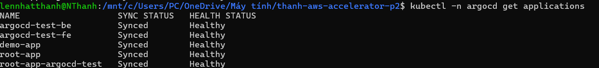
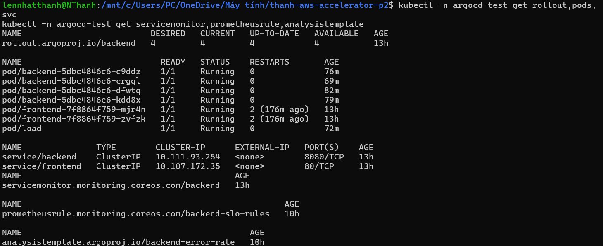
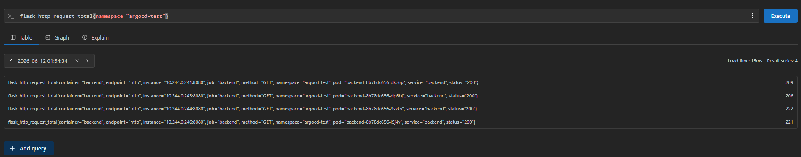
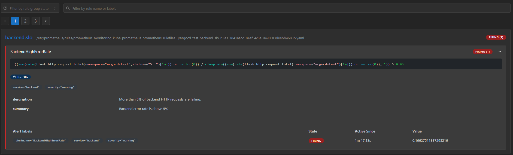
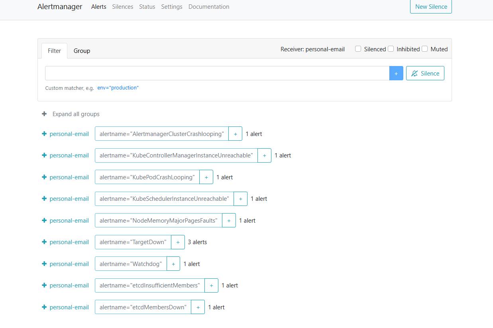
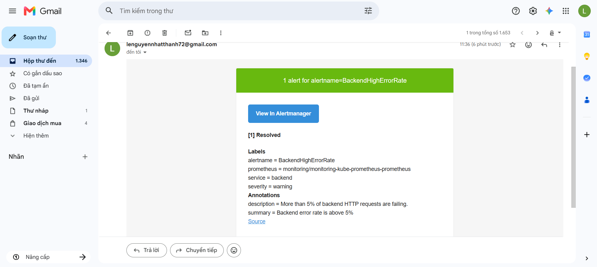
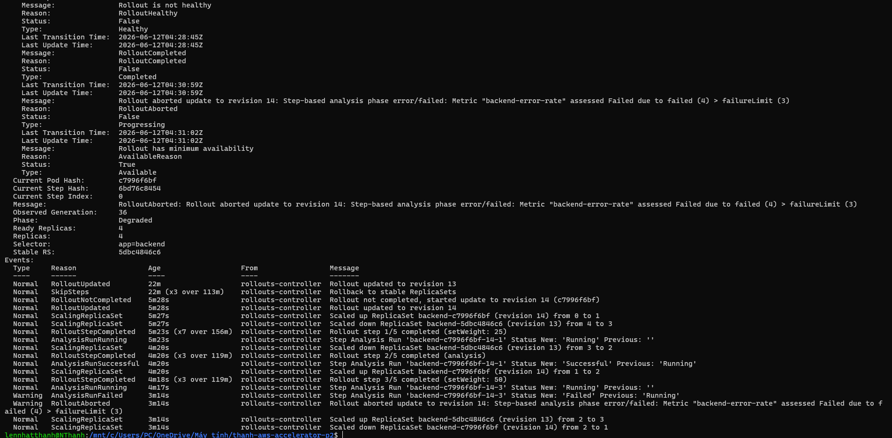
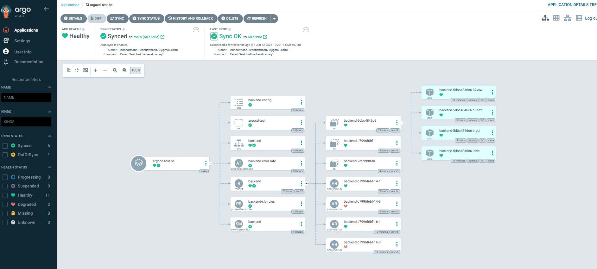

# Báo Cáo Bằng Chứng - W9 GitOps, Observability Và Canary

## Tổng Quan Dự Án

Dự án `cloud/w9/argocd-test` triển khai ứng dụng frontend/backend theo mô hình GitOps bằng Argo CD. Backend được triển khai bằng Argo Rollouts để hỗ trợ canary release, có Prometheus metrics, SLO alert, email notification và cơ chế auto-abort khi canary lỗi.

Các thành phần chính:

- Argo CD app-of-apps: `root-app-argocd-test`.
- Backend Application: `argocd-test-be`.
- Frontend Application: `argocd-test-fe`.
- Namespace workload: `argocd-test`.
- Backend: Flask app expose `/metrics`.
- Frontend: Nginx static site.
- Observability: Prometheus, ServiceMonitor, PrometheusRule, AlertmanagerConfig.
- Canary: Argo Rollouts + AnalysisTemplate.
- Rollback: Git revert + Argo CD sync.

## 1. Argo CD Quản Lý Ứng Dụng Theo GitOps

Ảnh minh chứng:



Kết quả ghi nhận:

- `root-app-argocd-test` ở trạng thái `Synced` và `Healthy`.
- `argocd-test-be` ở trạng thái `Synced` và `Healthy`.
- `argocd-test-fe` ở trạng thái `Synced` và `Healthy`.

Ý nghĩa:

Argo CD đang lấy manifest từ Git repository và tự động đồng bộ resource xuống Kubernetes cluster. Project dùng mô hình app-of-apps: root app quản lý các Application con của backend và frontend.

## 2. Argo CD Tree Có Đầy Đủ Resource Backend

Ảnh minh chứng:


Kết quả ghi nhận:

Tree của `argocd-test-be` có các resource chính:

- Namespace `argocd-test`.
- Service `backend`.
- Rollout `backend`.
- ServiceMonitor `backend`.
- PrometheusRule `backend-slo-rules`.
- AlertmanagerConfig `backend-email-alerts`.
- AnalysisTemplate `backend-error-rate`.

Ý nghĩa:

Backend không chỉ được deploy như workload thông thường mà còn có đầy đủ resource cho observability, alerting và canary analysis.

## 3. Backend Và Frontend Chạy Trong Kubernetes

Ảnh minh chứng:



Kết quả ghi nhận:

- Namespace `argocd-test` tồn tại.
- Backend chạy bằng `Rollout`.
- Frontend chạy bằng `Deployment`.
- Pod backend/frontend ở trạng thái `Running`.
- Service `backend` và `frontend` tồn tại.
- Các resource monitoring và rollout analysis đã được tạo trong cluster.

Ý nghĩa:

Ứng dụng đã được Argo CD sync thành resource thật trong Kubernetes cluster.

## 4. Prometheus Scrape Được Metrics Backend

Ảnh minh chứng:



Kết quả ghi nhận:

Prometheus query `flask_http_request_total{namespace="argocd-test"}` trả về metric của backend.

Ý nghĩa:

Backend expose `/metrics` thành công và `ServiceMonitor/backend` đã giúp Prometheus scrape được dữ liệu.

## 5. SLO Alert BackendHighErrorRate Firing

Ảnh minh chứng:



Kết quả ghi nhận:

Alert `BackendHighErrorRate` chuyển sang trạng thái `Firing` khi backend có error rate cao.

Ý nghĩa:

`PrometheusRule/backend-slo-rules` hoạt động đúng. Khi tỉ lệ HTTP 5xx của backend vượt ngưỡng 5% trong thời gian cấu hình, Prometheus tạo alert.

## 6. Alertmanager Nhận Alert Và Gửi Email

Ảnh minh chứng Alertmanager:



Ảnh minh chứng email:



Kết quả ghi nhận:

- Alertmanager nhận alert `BackendHighErrorRate`.
- Email cá nhân nhận được cảnh báo từ Alertmanager.

Ý nghĩa:

Luồng alert end-to-end đã hoạt động:

```text
PrometheusRule
  -> Alertmanager
  -> AlertmanagerConfig
  -> Gmail SMTP
  -> Email cá nhân
```

## 7. Canary Bad Version Tự Abort Bằng AnalysisTemplate

Ảnh minh chứng:



Kết quả ghi nhận:

- Rollout tạo ReplicaSet mới cho bad version.
- Canary đi tới step analysis.
- `AnalysisRun` được tạo.
- `AnalysisRun` fail do backend error rate vượt ngưỡng.
- Rollout abort bad canary và không promote lên 100%.

Ý nghĩa:

Argo Rollouts tự động kiểm tra chất lượng canary bằng `AnalysisTemplate/backend-error-rate`. Nếu Prometheus báo error rate xấu, bad version bị abort tự động.

## 8. Rollback Bằng Git Revert

Ảnh minh chứng Git revert:


Ảnh minh chứng Argo CD sau rollback:



Kết quả ghi nhận:

- Commit lỗi được revert bằng `git revert`.
- Commit revert được push lên Git.
- Argo CD sync lại trạng thái ổn định.
- Backend quay về version ổn định.
- Rollout `backend` Healthy.
- Alert được resolve.
- Rollback hoàn tất dưới 5 phút.

Ý nghĩa:

Rollback tuân thủ GitOps: không sửa tay trong cluster, mà đảo thay đổi bằng Git commit mới rồi để Argo CD đồng bộ cluster về trạng thái mong muốn.

## Checklist Bằng Chứng

Các ảnh minh chứng được đặt trong thư mục `evidence/`:

```text
evidence/01-argocd-apps.png
evidence/02-argocd-tree.png
evidence/03-k8s-resources.png
evidence/04-prometheus-query.png
evidence/05-prometheus-alert-firing.png
evidence/06-alertmanager-alert.png
evidence/07-email-received.png
evidence/08-rollout-analysis-failed.png
evidence/09-git-revert.png
evidence/10-rollback-healthy.png
```

## Kết Luận Theo Acceptance Criteria

Dự án đáp ứng các yêu cầu chính:

- App được quản lý bằng GitOps thông qua Argo CD app-of-apps.
- Backend/frontend chạy trong namespace `argocd-test`.
- Backend expose Prometheus metrics qua `/metrics`.
- Prometheus scrape backend bằng `ServiceMonitor`.
- `PrometheusRule` tạo SLO alert `BackendHighErrorRate`.
- `AlertmanagerConfig` gửi alert tới email cá nhân qua Gmail SMTP.
- Backend dùng Argo Rollouts canary.
- `AnalysisTemplate` query Prometheus để auto-abort bad version.
- Rollback được thực hiện bằng `git revert` và Argo CD sync lại trong dưới 5 phút.
